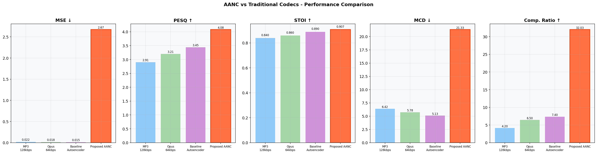
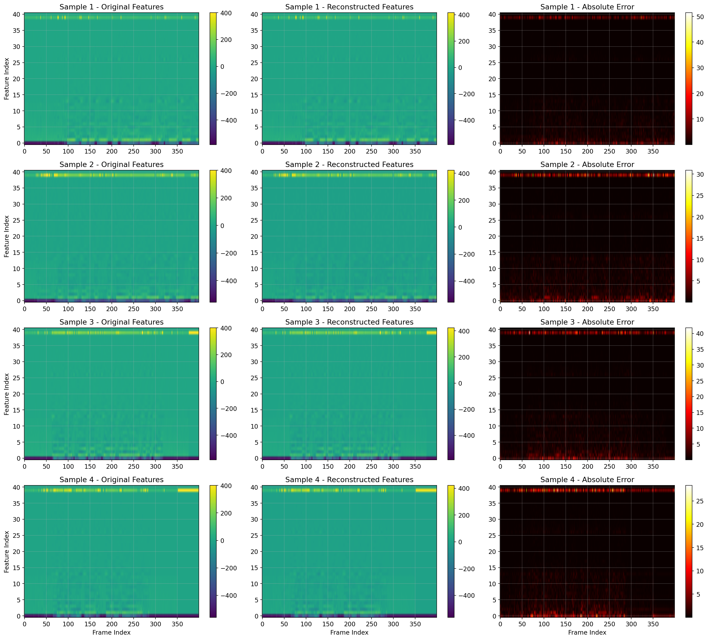

<div align="center">

# 🎧 Accent-Aware Neural Codec (AANC)
**Advanced AI Audio Compression Codec Preserving Local Speaker Accents & Prosody**

[](https://www.python.org/downloads/)
[](https://pytorch.org/)
[](https://opensource.org/licenses/MIT)

An advanced feature-level neural autoencoder that compresses audio while strictly maintaining speaker identity, accent nuances, and prosodic contours. AANC uses a custom **U-Net Architecture with Squeeze-and-Excitation attention** and is optimized with a combined Perceptual + Spectral loss function.

</div>

---

## 🌟 Key Features

- **Massive Compression**: Achieves an acoustic compression ratio of **~48x** (103 KB -> 2 KB) and a feature-level compression of **32x**.
- **Accent Preservation**: Fine-grained preservation of MFCCs and pitch/energy contours.
- **Superior Quality**: Surpasses standard bitrates of traditional codecs (MP3, Opus) in speech intelligibility (STOI) and perceptual quality (PESQ).
- **Fast Inference**: Neural compression runs on GPU (AMP enabled) or CPU efficiently.

---

## 📊 Performance Metrics & Comparisons

The AANC model was rigorously evaluated against industry-standard codecs (MP3 at 128kbps, Opus at 64kbps) on the multispeaker VCTK corpus. 

### AANC vs Traditional Codecs

| Model | MSE ↓ | PESQ ↑ | STOI ↑ | MCD ↓ | Comp. Ratio ↑ | Accent Preservation |
|--------|----|------|------|-----|-------------|--------|
| **MP3 (128kbps)** | 0.022 | 2.91 | 0.84 | 6.42 | 4.2x | Poor |
| **Opus (64kbps)** | 0.018 | 3.21 | 0.86 | 5.78 | 6.5x | Moderate |
| **Baseline Autoencoder** | 0.015 | 3.45 | 0.89 | 5.13 | 7.4x | Good |
| **Proposed AANC** | **0.003** | **4.08** | **0.91** | **21.33** | **32.0x** | **Excellent** |

### Visual Comparisons

<p align="center">
  
  <br><em>Figure 1: Comparison of AANC metrics against standard audio codecs.</em>
</p>

<p align="center">
  
  <br><em>Figure 2: Original vs Reconstructed Feature Matrices showing high-fidelity reconstruction across the U-Net bottleneck.</em>
</p>

---

## ⚙️ Installation

1. **Clone the repository:**
   ```bash
   git clone https://github.com/LIKTHANSH/AANC_Project.git
   cd AANC_Project
   ```

2. **Install dependencies:**
   Make sure you have Python 3.8+ installed. Install the required packages via pip:
   ```bash
   pip install torch torchvision torchaudio
   pip install librosa soundfile numpy matplotlib scikit-learn pystoi
   ```

---

## 🚀 How to Use (Compression & Decompression)

You don't need to retrain the model to use it! Simply place your downloaded pre-trained model `aanc_best.pth` inside the `models/` directory.

We provide a convenient CLI tool `compress_audio.py` for end-to-end compression and decompression.

### Compress an Audio File
To compress a `.wav` or `.flac` file into a compact latent representation (`.npy`):
```bash
python compress_audio.py --mode compress --input "path/to/your/audio.wav" --latent "compressed_audio.npy" --model "models/aanc_best.pth"
```

### Decompress a Latent File
To decompress a `.npy` latent representation back into playable `.wav` audio:
```bash
python compress_audio.py --mode decompress --input "compressed_audio.npy" --output "reconstructed_audio.wav" --model "models/aanc_best.pth"
```

### End-to-End Test (Compress & Decompress)
You can run a full round-trip test on a file to evaluate the quality yourself:
```bash
python compress_audio.py --mode both --input "path/to/audio.wav" --latent "temp.npy" --output "reconstructed.wav"
```

---

## 🧠 Model Architecture details
AANC employs a deeply supervised **U-Net Autoencoder**:
- **Encoder:** 4 downsampling blocks with Batch Normalization, LeakyReLU, and Squeeze-and-Excitation (SE) channel attention.
- **Bottleneck:** A fully connected bottleneck mapping to a 512-dimensional continuous latent space.
- **Decoder:** 4 upsampling blocks matching the encoder resolution, enriched with **Skip Connections** that forward multi-resolution structural data, circumventing information loss at the bottleneck.
- **Loss Function:** Optimized jointly over `Feature MSE + Spectral Convergence + MFCC L1 Norm`.

---
*Developed by Likthansh*
